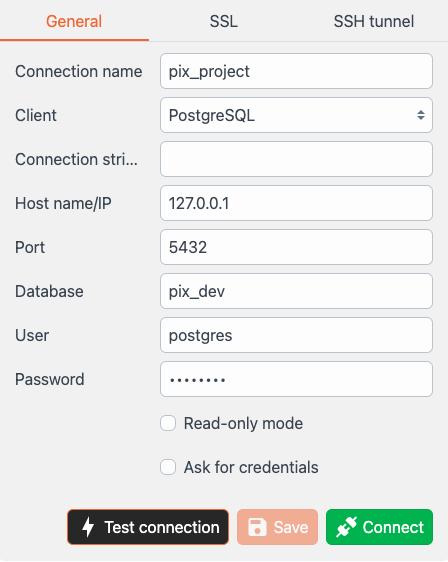

# devapp Project 2.1

API com rotas destinadas a gerar mapas de altura do algodão.

> &nbsp;  
> Acesse a API clicando no botão abaixo:
>

<p align="center">
  <a href="https://example.com" class="btn">DevAppProjectAPI</a>
</p>

<blockquote style="background-color: #f9f9f9; border-left: 10px solid #f39c12; padding: 10px;">
  <strong>Atenção:</strong><br>
Para acessar a api é necessário estar autorizado. Assim você precisará das credenciais
</blockquote>


## Requisitos

- Python 3.10
- Docker & docker compose


<blockquote style="border-left: 6px solid #537FE7; background-color: #E9F8F9; padding: 10px; margin: 0 0 20px;">
  <strong>Importante:</strong><br>
  Os comandos apresentados serão executados em um terminal Linux. Se estiver no Windows, recomendo usar o WSL (Windows Subsystem for Linux), uma máquina virtual ou um container Linux, ou por conta própria adaptar os comandos necessários.
</blockquote>


## O Projeto
Descrição do projeto

## Funcionalidades

### Gerar mapa de aplicação

- gera um mapa de aplicação

### Utilitários

- Obtêm o shape de um talhão pelo id agrosig
- Obtêm o id do banco de dados analytics a partir de um id do agrosig
- Obtêm o id do agrosig a partir de um id do analytics.
- Verifica se existe informações de amostra de altura disponíveis para um respectivo id do agrosig.


## Estrutura de pastas e arquivos


<details class="file-tree" open>
  <summary>File Tree</summary>
  <pre>
    <code>

.
├── 🐳 docker-compose.yaml          # Orquestração de containers
├── 🐳 Dockerfile.dev               # Imagem principal
├── 📄 MANIFEST.in                  # Arquivos incluídos na aplicação
├── 📄 requirements-dev.txt         # Dependências de ambiente dev
├── 📄 requirements.in              # Dependências de produção
├── 🔒 .secrets.toml                # Senhas locais
├── ⚙️ settings.toml                # Configurações locais
├── 📄 setup.py                     # Instalação do projeto
├── 📄 test.sh                      # Pipeline de CI em ambiente dev
├── 📁 app
│   ├── 📄 __init__.py
│   ├── 🐍 app.py                   # FastAPI app
│   ├── 🐍 auth.py                  # Autenticação via token
│   ├── 🐍 cli.py                   # Aplicação CLI `$ app adduser` etc
│   ├── 🐍 config.py                # Inicialização da config
│   ├── 🐍 db.py                    # Conexão com o banco de dados
│   ├── 🐍 default.toml             # Config default
│   ├── 🐍 security.py              # Password Validation
│   ├── 📁 models
│   │   ├── 📄 __init__.py
│   │   ├── 🐍 application_map.py   # ORM e Serializers de mapa de aplicação
│   │   ├── 🐍 data_sources.py      # ORM e Serializers de data sources
│   │   ├── 🐍 data_sources_keys.py # ORM e Serializers de keys dos datasource
│   │   ├── 🐍 products.py          # ORM e Serializers de produtos gerados no processo
│   └── 📁 routes
│       ├── 📄 __init__.py
│       ├── 🐍 auth.py              # Rotas de autenticação via JWT
│       ├── 🐍 application_map.py   # CRUD de inicialização de processamento de um mapa
│       └── 🐍 utility.py           # CRUD de utilitários visando facilitar o uso da API
├── 📁 business
│   ├── 🐍 credentials.py           # Carrega os as variáveis de ambiente dos bancos de select
│   ├── 🐍 dto.py                   # Data transfer object, guarda as informações do processo
│   ├── 🐍 engine.py                # Engine de inicialização do processo
│   ├── 🐍 engine_logged.py         # Decorator de uma engine (abilidade de logar as info)
│   ├── 📁 models
│   │   ├── 📁 clusterization       # Controler - seleciona o método de clusterização
│   │   └── 📁 interpolation        # Contém classe utilizada para realizar interpolação
│   └── 📁 spatial_data_tools       # Classes destinadas a tranformações de objetos espaciais
│       ├── 🐍 raster_downgrader.py
│       ├── 🐍 raster_to_dataframe_converter.py
│       ├── 🐍 reprojectors.py
── 📁 infra
│   ├── 🐍 analitics_connect.py     # Classe de conexão com o banco analytics
│   ├── 🐍 athena_connect.py        # Classe de conexão com o athena
│   ├── 🐍 aws_cli_connect.py       # Classe de conexão com aws s3
├── 📁 interfaces                   # Interfaces utilizadas no processo de desenvolvimento
│   ├── 🐍 clusterizer.py
│   ├── 🐍 database_connection.py
│   ├── 🐍 engine.py
│   ├── 🐍 methodology.py
│   ├── 🐍 repository_orm.py
├── 📁 migrations                   # Arquivos de migration gerados pelo alembic
│   ├── README
│   ├── 🐍 env.py
│   ├── script.py.mako
│   └── versions
│       ├── 🐍 9a039b72e0f4_initial.py
│       ├── 🐍 fcfa7920bdeb_populate_data_sources_table.py
├── 📁 postgres
│   ├── 📄 create-databases.sh      # Script de criação do DB
│   └── 🐳 Dockerfile               # Imagem do SGBD
└── 📁 tests
    ├── 📄 conftest.py              # Config do Pytest
    ├── 📄 __init__.py
    └── 🐍 test_api.py              # Tests da API
    </code>
  </pre>
</details>

# Guia para configurar ambiente de Desenvolvimento
Resumo: O ambiente de desenvolvimento foi configurado para que a API rode dentro de um container. O ambiente conta também com um container com uma abstração do banco de dados onde a aplicação fará inserts. Foi criado também para o docker da api um `cli` que já possui algumas funcionalidades que poderão ser úteis. Durante o processo de desenvolvimento não é necessário reiniciar ou copiar arquivos para o docker, alteraçoes feitas no projeto serão autimaticamente atualizadas dentro do docker e você poderá testar a aplicação. 


## Guia Rápido

Abaixo segue um guia com os comandos que você terá que executar no terminal considerando que você acabou de clonar este repositório e criou o arquivo de variáveis de ambiente. Recoemndo que você leia toda a documentação, mas caso queira ir direto ao ponto, siga os passos abaixo:

  ```bash
  $ python3.10 -m venv .venv
  $ source .venv/bin/activate
  $ pip install --upgrade pip
  $ pip install -r requirements-dev.txt
  $ pip install -e .
  ```

Antes de fazer o `docker compose` up crie um arquivo `.env` com suas varáveis de ambiente:

```txt
ANALYTICS_DATABASE=value2
ANALYTICS_USER=value3
ANALYTICS_PASSWORD=value4
ANALYTICS_HOST=value5
ANALYTICS_PORT=value6
AWS_ACCESS_KEY_ID=value7
AWS_SECRET_ACCESS_KEY=value8
AWS_DEFAULT_REGION=value9
ATHENA_S3_STAGING_DIR=value1
```

```bash
  $ docker compose build
  $ docker compose up
  ```

  feito isto a api estará rodando e poderá ser acessada em http://0.0.0.0:8000. Recomendo que durante o processo de desenvolviemnte faça um split no seu terminal e deixe a api rodando em um e no outro você deixe disponível o terminal do docker. Para isso execute o comando abaixo no terminal:

  ```bash
  $ docker compose exec api /bin/bash
  ```
Foi criado dentro da aplicação um `CLI` para lhe ajudar no processo de desenvolvimento. existe uma série de funcionalidades você pode ver a lista executando no terminal do container que acabou de abrir:

```bash
$ devapp --help
```

Como esta é a primeira vez que estamos executando este container, execute o camando a seguir no terminal do container:

```bash
$ devapp init-dev-data-base
```
Agora tudo está pronto para o processo de desenvolvimento. O projeto conta com um CI de testes configurado, leia a seção que fala sobre os testes aqui na documentação.


## Variáveis de ambiente

Primeiramente crie na raiz do projeto um arquivo chamado `.env`. Neste arquivo adicione as variáveis de ambiente como a seguir. `Não` adicione `espaço` entre o nome da `variável de ambiente` e o `=` ou entre o `=` e o `valor`:

```txt
ANALYTICS_DATABASE=value2
ANALYTICS_USER=value3
ANALYTICS_PASSWORD=value4
ANALYTICS_HOST=value5
ANALYTICS_PORT=value6
AWS_ACCESS_KEY_ID=value7
AWS_SECRET_ACCESS_KEY=value8
AWS_DEFAULT_REGION=value9
ATHENA_S3_STAGING_DIR=value1

```

<blockquote style="border-left: 6px solid #537FE7; background-color: #E9F8F9; padding: 10px; margin: 0 0 20px;">
  <strong>Importante:</strong><br>
  Adicione o arquivo .env ao gitignore, para que suas credenciais não sejam enviadas para o repositódio remoto. 
</blockquote>


## Ambiente Virtual

É necessário um ambiente virtual para instalar
as dependências do projeto.

```bash
python -m venv .venv
```

Ative o virtualenv

```bash
# Linux
source .venv/bin/activate
# Windows Power Shell
.\venv\Scripts\activate.ps1
```
No arquivo  `requirements-dev.txt` temos algumas ferramentas de produtividade, você poderá instalar estas dependencias executando:

```bash
pip install --upgrade pip
pip install -r requirements-dev.txt
```


No arquivo  `requirements-dev.txt` temos algumas ferramentas de produtividade, você poderá instalar estas dependencias executando:

```bash
pip install --upgrade pip
pip install -r requirements-dev.txt
```


```bash
$ pip install -e .
```
Isto instalará de forma editável o projeto em sua máquina.

Se vocé executar:
```bash
$ pip list | grep -i devapp 
$ pip show devapp
```
será exibido o local em sua máquina onde o projeto está instalado e detalhes do projeto.

## Rodando um banco de dados em container

Agora precisaremos de um banco de dados e vamos usar o PostgreSQL dentro de
um container. Esta aplicação está configurada para levantar dois bancos de dados `devapp_test` e `devapp_dev`.  

O banco `devapp_test` será utilizado para executar testes no processo de CI ao subir a aplicação utilizamos este banco apenas para verificar se nossa engine está logando corretamente as informações no banco fazendo inserts e updates.

O banco `devapp_dev` é destinado para desenvolvimento, então nos passos a seguir será mostrado como realizar o processo de executar o docker-compose da aplicação com o banco de dados, e como rodar as migrations para deixar o banco `devapp_dev` pronto para trabalhar.

Para iniciar a nossa API + o Banco de dados vamos utilizar um orquestrador de containers, em produção isso será feito com Kubernetes mas no ambiente de desenvolvimento utilizamos o docker compose (`docker-compose.yaml`).

- Definimos 2 serviços `api` e `db`
- Informamos os parametros de build com os dockerfiles
- Na `api` abrimos a porta `8000`
- Na `api` passamos 2 variáveis de ambiente `PIX_DB__uri` e `PIX_DB_connect_args` para usarmos na conexão com o DB. As demais variáveis de ambientes que a api irá utilizar serão automaticamente carregadas do arquivo `.env`.
- Marcamos que a `api` depende do `db` para iniciar.
- No `db` informamos o setup básico do postgres e pedimos para criar 2 bancos de dados, um para a app e um para testes.

Se você ainda não havia configurado o projeto em sua máquina execute inicialmente o build do compose executando:

```bash
$ docker-compose build
```
Feito isto uma vez não será necessário executar novamente no futuro pois a imagem já está construída, então vá para o próximo passo.

Para iniciar o serviço basta executar:

```bash
$ docker compose up
```

Você pode acessar o banco de dados usando `debeaver` ou `Antares` como a seguir, lembre-se que o Password é `postgres`:



## API

Você pode acessar a API em: http://0.0.0.0:8000/docs


A API vai ser atualizada automaticamente quando detectar mudanças no código.

## Migrations

Rode as migrations, mas é muito importante que você faça isto unicamente no terminal do docker. Assim execute:

```bash
$ docker compose exec api /bin/bash  
```

Isto lhe dará acesso ao terminal do docker. Feito isto, execute o script de migração, ele automaticamente irá criar as tabelas no banco de desenvolvimento e irá preencher a tabela `aplication_maps_datasources`.

```bash
alembic upgrade head
```

Se você preferir pode ser utilizado o `cli` do container para realizar as tarefas de interação com o banco igual a esta, executando:

```bash
$ devapp init-dev-data-base
```

Tudo pronto, o banco de dados local está configurado. 

Observações:

1. Banco de dados de produção: Os dados que precisamos ler para processar uma imagem são lidos do banco de produção. Como estas tabelas são utilizadas apenas para `select` suas abstrações não estão no nosso banco local e utilizamos de fato o banco de produção. Estas tabelas estão em:
    * analytics: banco de dados postgre
    * athena: tableas disponíveis no athena
Note que as credenciais para acessar estas fontes devem estar no arquivo `.env` como falado inicialmente, o build do docker compose irá automaticamente adicioná-las as variáveis de ambiente do docker

2. Banco de dados de desenvolvimento: Neste banco de dados estão as tabelas que nossa aplicação utiliza para logar as informações do processo. Assim durante o processo de desenvolvimento nossa API irá utilizar este banco de dados para logar as informações.

3. Preferencialmente testes as alterações que fizer no código com o docker em execução. Uma vez que você realizar todo o processo descrito, o seu docker atualizará automaticmaente qualquer alteração que for feita em um arquivo dentro deste repositório. Então você pode utilizar qualquer editor. 

4. Se você decidir executar a API fora do docker recomendo que você sete a session da `LoggedEngine` Para isto você pode obter a session simplesmente fazendo:

```python
from app.db import get_session
session = get_session()

Descrever restante.

```

## Testando

O Pipeline de testes será

0. Garantir que o ambiente está em execução com o docker compose
1. Garantir que existe um banco de dados `devapp_test` e que este banco está
   vazio.
2. Executar as migrations com alembic e garantir que funcionou
3. Executar os testes com Pytest
4. Apagar o banco de dados de testes

Foi adicionado um comando `reset_db` no cli

> **NOTA** muito cuidado com esse comando!!!

Para transformar o arquivo `test.sh em algo executável execute o comando a seguir no terminal:

```bash
$ chmod +x test.sh
```

No mesmo terminal execute:

```bash
$ ./test.sh
```

os testes serão executados.

<style>
  .btn {
    display: inline-block;
    background-color: #4CAF50;
    color: white;
    padding: 10px 20px;
    text-align: center;
    text-decoration: none;
    border-radius: 5px;
  }
   .file-tree {
    border: 1px solid #ddd;
    border-radius: 5px;
    padding: 10px;
    margin: 10px 0;
    max-width: 600px;
    font-family: monospace;
    max-height: 600px; /* Increase the container height */
    overflow-y: auto; /* Enable vertical scrolling if necessary */
  }

  .file-tree summary {
    font-size: 18px;
    font-weight: bold;
    cursor: pointer;
  }

  .file-tree pre {
    margin: 0;
    padding: 10px;
    background-color: #f9f9f9;
    border-radius: 5px;
  }

  .file-tree code {
    display: block;
  }

  /* Additional CSS for styling folder and file icons */
  img[alt="📁"] {
    width: 16px;
    height: 16px;
    margin-right: 5px;
  }

  img[alt="🐍"] {
    width: 16px;
    height: 16px;
    margin-right: 5px;
  }

  img[alt="🐳"] {
    width: 16px;
    height: 16px;
    margin-right: 5px;
  }

  img[alt="🔒"] {
    width: 16px;
    height: 16px;
    margin-right: 5px;
  }

  img[alt="⚙️"] {
    width: 16px;
    height: 16px;
    margin-right: 5px;
  }
</style>
